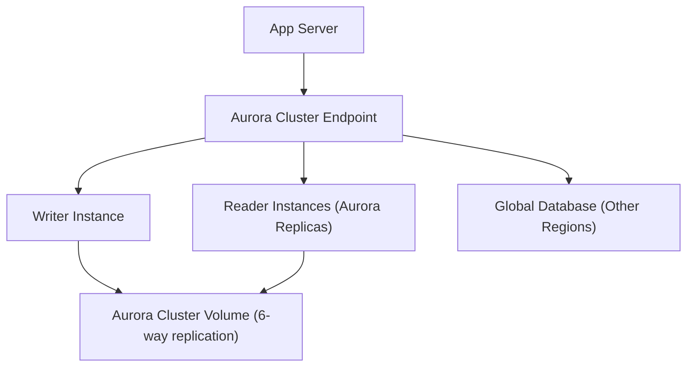

# Amazon Aurora - Detailed Overview

## What is Aurora?
Amazon Aurora is a fully managed, MySQL- and PostgreSQL-compatible relational database engine, designed for high performance, availability, and global scale. Aurora combines the speed and reliability of high-end commercial databases with the simplicity and cost-effectiveness of open-source databases.

## Why Use Aurora?
- **Performance:** Up to 5x faster than standard MySQL, 3x faster than PostgreSQL.
- **High availability:** 6-way replication across 3 AZs, automatic failover.
- **Fully managed:** AWS handles backups, patching, scaling, and failover.
- **MySQL/PostgreSQL compatible:** Use existing tools and drivers.
- **Global scale:** Global databases for multi-region, low-latency apps.
- **Serverless option:** Auto-scales compute based on demand.

## Core Architecture
- **Decoupled compute and storage:** Compute (DB instances) and storage (cluster volume) scale independently.
- **Cluster volume:** Distributed, fault-tolerant, self-healing storage system that auto-scales up to 128 TB.
- **Replication:** 6 copies of data across 3 AZs for durability and availability.
- **Endpoints:** Cluster endpoint (read/write), reader endpoint (load-balanced reads), instance endpoints.

## Key Features
### 1. **MySQL & PostgreSQL Compatibility**
- Drop-in replacement for MySQL 5.6/5.7/8.0 and PostgreSQL 10/11/12/13/14.
- Use standard SQL, tools, and drivers.

### 2. **Aurora Replicas**
- Up to 15 Aurora Replicas for read scaling (across AZs).
- Automatic failover to replicas in case of primary failure.

### 3. **Global Databases**
- Replicate data with sub-second latency to up to 5 secondary AWS regions.
- Fast disaster recovery and low-latency global reads.

### 4. **Aurora Serverless v2**
- Auto-scales compute capacity instantly based on load.
- Pay-per-use billing (per second).
- Ideal for variable or unpredictable workloads.

### 5. **Backups & Snapshots**
- Continuous backups to S3 (no performance impact).
- Point-in-time recovery.
- Manual snapshots for long-term retention.

### 6. **Security**
- Encryption at rest (KMS) and in transit (TLS).
- VPC integration, IAM authentication, and fine-grained access control.

### 7. **Performance Insights**
- Advanced monitoring and query analysis.

## Step-by-Step: Creating an Aurora Cluster (Console)
1. Go to the RDS Dashboard in AWS Console.
2. Click "Create database".
3. Select "Amazon Aurora" as the engine.
4. Choose MySQL or PostgreSQL compatibility.
5. Configure cluster settings (name, master user, password).
6. Choose instance class, storage, and Multi-AZ.
7. (Optional) Enable Aurora Serverless.
8. Configure VPC, subnet, and security group.
9. Launch and connect using the cluster endpoint.

## Real-World Example: Global SaaS Application
- Use Aurora Global Database for low-latency reads in multiple regions.
- Aurora Replicas for read scaling and high availability.
- Serverless for unpredictable workloads (e.g., dev/test, spiky traffic).

## Advanced Features & Best Practices
- **Use Aurora Replicas for scaling and failover.**
- **Enable Performance Insights for query tuning.**
- **Use Global Database for disaster recovery and global apps.**
- **Monitor with CloudWatch and Enhanced Monitoring.**
- **Encrypt data at rest and in transit.**
- **Automate backups and test restores regularly.**

## Common Pitfalls & Misconceptions
- **Aurora is not a drop-in for all MySQL/PostgreSQL features:** Some features/extensions may not be supported.
- **Serverless is not for all workloads:** Not ideal for high, steady workloads (use provisioned instances).
- **Global Database writes are only in one region:** Other regions are read-only until failover.
- **Failover time is typically under 30 seconds, but can vary.**

## How Aurora Fits in AWS Architectures
- Aurora is the go-to for high-performance, highly available, and globally distributed relational databases.
- Used for SaaS, e-commerce, gaming, analytics, and more.
- Integrates with Lambda, DMS, Glue, and other AWS services.

## Visual Diagram

## Further Reading
- [Aurora Documentation](https://docs.aws.amazon.com/AmazonRDS/latest/AuroraUserGuide/)
- [Aurora Serverless](https://docs.aws.amazon.com/AmazonRDS/latest/AuroraUserGuide/aurora-serverless.html)
- [Best Practices](https://docs.aws.amazon.com/AmazonRDS/latest/AuroraUserGuide/Aurora.BestPractices.html)
