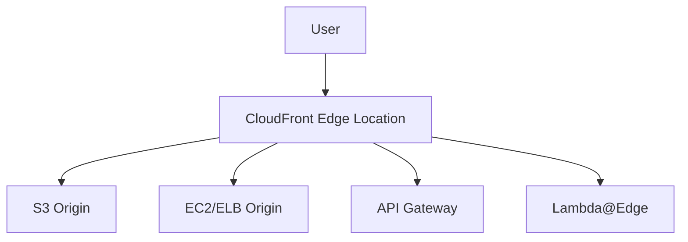

# Amazon CloudFront - Detailed Overview

## What is CloudFront?
Amazon CloudFront is a global Content Delivery Network (CDN) that securely delivers data, videos, applications, and APIs to users with low latency and high transfer speeds. It caches content at edge locations worldwide, reducing load on your origin servers and improving user experience.

## Why Use CloudFront?
- **Global performance:** Content is delivered from the nearest edge location to the user
- **Scalability:** Handles sudden traffic spikes automatically
- **Security:** Integrates with AWS Shield, WAF, and supports HTTPS, signed URLs, and Field-Level Encryption
- **Cost-effective:** Reduces data transfer and compute costs by offloading traffic from your origin
- **Integrated with AWS:** Works with S3, EC2, ELB, API Gateway, and more

## Core Concepts
### 1. **Distributions**
- **Web Distribution:** For HTTP/HTTPS content (websites, APIs, S3, etc.)
- **RTMP Distribution:** (Deprecated) For streaming media using Adobe Flash

### 2. **Origins**
- The source of your content (S3 bucket, EC2, ELB, on-premises server, etc.)

### 3. **Edge Locations**
- Global network of data centers where CloudFront caches content
- Over 400 edge locations and 13 regional edge caches (as of 2024)

### 4. **Behaviors**
- Rules that determine how CloudFront handles requests (cache policy, path pattern, allowed methods, etc.)

### 5. **Caching**
- **Object caching:** Content is cached at edge locations based on TTL (Time to Live)
- **Invalidation:** Remove objects from cache before TTL expires
- **Cache policies:** Control what is cached (headers, cookies, query strings)

### 6. **Security**
- **HTTPS:** Encrypt data in transit
- **Signed URLs/Cookies:** Restrict access to premium content
- **Field-Level Encryption:** Encrypt sensitive data at the edge
- **AWS WAF & Shield:** Protect against DDoS and web attacks
- **Origin Access Control (OAC):** Secure S3 origins (replaces OAI)

### 7. **Lambda@Edge**
- Run custom code at CloudFront edge locations to modify requests/responses
- Use cases: A/B testing, URL rewrites, authentication, header manipulation

## Step-by-Step: Setting Up a CloudFront Distribution (Console)
1. Go to the CloudFront Dashboard in AWS Console
2. Click "Create Distribution"
3. Choose origin (S3, EC2, ELB, etc.)
4. Configure default behavior (cache policy, allowed methods, viewer protocol policy)
5. (Optional) Add additional behaviors for specific paths
6. Set up security (HTTPS, OAC, WAF, etc.)
7. Create distribution and use the provided domain name (or custom CNAME)

## Real-World Example: Secure Static Website
- Host static website in S3 (private bucket)
- Use CloudFront with OAC to serve content securely
- Enable WAF for protection, HTTPS for encryption, and cache policies for performance

## Advanced Features & Best Practices
- **Use OAC for S3 origins (OAI is legacy)**
- **Enable logging for monitoring and troubleshooting**
- **Use Lambda@Edge for custom logic at the edge**
- **Set appropriate cache TTLs for dynamic vs. static content**
- **Enable HTTP/2 and IPv6 for better performance**
- **Monitor with CloudWatch metrics and alarms**

## Common Pitfalls & Misconceptions
- **Invalidation requests are not free (first 1,000/month are free)**
- **Caching dynamic content requires careful cache policy configuration**
- **Origin must be publicly accessible or use OAC/OAI for S3**
- **Propagation delay:** Distribution changes can take minutes to deploy globally

## How CloudFront Fits in AWS Architectures
- CloudFront is the default CDN for AWS workloads
- Used for static/dynamic websites, APIs, video streaming, security, and DDoS protection
- Integrates with S3, EC2, ELB, API Gateway, Lambda@Edge, WAF, and more

## Visual Diagram

## Further Reading
- [CloudFront Documentation](https://docs.aws.amazon.com/AmazonCloudFront/latest/DeveloperGuide/)
- [Best Practices](https://docs.aws.amazon.com/AmazonCloudFront/latest/DeveloperGuide/best-practices.html)
- [Lambda@Edge](https://docs.aws.amazon.com/AmazonCloudFront/latest/DeveloperGuide/lambda-at-the-edge.html)
