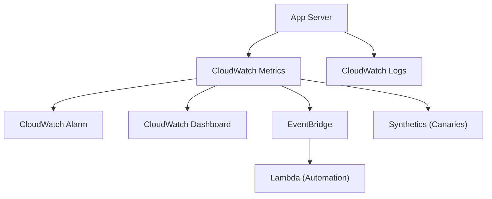

# Amazon CloudWatch - Detailed Overview

## What is CloudWatch?
Amazon CloudWatch is AWS’s monitoring and observability service. It collects and tracks metrics, collects and monitors log files, sets alarms, visualizes data, and automatically reacts to changes in your AWS resources and applications.

## Why Use CloudWatch?
- **Centralized monitoring:** View metrics and logs from all AWS resources in one place
- **Automated alerting:** Set alarms to notify or trigger actions on thresholds
- **Troubleshooting:** Analyze logs and metrics to diagnose issues
- **Cost optimization:** Monitor usage and set alarms for unexpected costs
- **Integrated with AWS:** Works with EC2, Lambda, RDS, ECS, EKS, S3, API Gateway, and more

## Core Concepts
### 1. **Metrics**
- Numeric data points (e.g., CPUUtilization, NetworkIn)
- Collected at 1- or 5-minute intervals (detailed monitoring = 1 min)
- Custom metrics supported (e.g., app-specific KPIs)

### 2. **Logs**
- Collect, store, and analyze logs from EC2, Lambda, VPC Flow Logs, API Gateway, and custom sources
- Log groups and log streams organize and manage logs
- Supports metric filters, retention policies, and subscription filters (for streaming to Lambda, Kinesis, etc.)

### 3. **Alarms**
- Monitor metrics and trigger actions (SNS, Auto Scaling, EC2 actions, etc.)
- Support for static and anomaly detection thresholds
- Composite alarms combine multiple alarms for complex alerting

### 4. **Dashboards**
- Visualize metrics and logs in customizable dashboards
- Share dashboards with teams or management

### 5. **Events (EventBridge)**
- Respond to changes in AWS resources (e.g., EC2 state change, S3 object created)
- Automate workflows with rules and targets (Lambda, Step Functions, etc.)

### 6. **Synthetics**
- Monitor endpoints with canaries (automated scripts that test APIs/websites)
- Detect outages and performance issues proactively

### 7. **Contributor Insights**
- Analyze high-cardinality log data to find top contributors to traffic, errors, or costs

### 8. **ServiceLens & X-Ray Integration**
- End-to-end tracing and service map for distributed applications

## Step-by-Step: Setting Up CloudWatch Monitoring (Console)
1. Go to the CloudWatch Dashboard in AWS Console
2. View metrics for your AWS resources (EC2, Lambda, etc.)
3. Create custom dashboards to visualize key metrics
4. Set up alarms for critical metrics (e.g., CPU > 80%)
5. Enable log collection for applications and AWS services
6. Use metric filters and Contributor Insights for advanced analysis

## Real-World Example: Auto Scaling Web App
- Monitor EC2 CPUUtilization and set an alarm to trigger Auto Scaling
- Collect application logs for troubleshooting
- Use dashboards to visualize health and performance
- Set up canaries to monitor website uptime

## Advanced Features & Best Practices
- **Use detailed monitoring for critical resources**
- **Set up composite alarms for complex alerting**
- **Use Contributor Insights for high-cardinality log analysis**
- **Integrate with Lambda for automated remediation**
- **Monitor custom metrics for app-specific KPIs**
- **Set log retention policies to control costs**

## Common Pitfalls & Misconceptions
- **Default metrics may not be enough:** Use custom metrics for app-level monitoring
- **Log ingestion and retention can incur significant costs**
- **Alarms only trigger on published metrics (check data frequency)**
- **Synthetics and Contributor Insights are billed separately**

## How CloudWatch Fits in AWS Architectures
- CloudWatch is the default monitoring and observability tool for AWS
- Used for alerting, troubleshooting, cost optimization, and automation
- Integrates with all major AWS services and custom apps

## Visual Diagram

## Further Reading
- [CloudWatch Documentation](https://docs.aws.amazon.com/AmazonCloudWatch/latest/monitoring/)
- [Best Practices](https://docs.aws.amazon.com/AmazonCloudWatch/latest/monitoring/best-practices.html)
- [CloudWatch Logs](https://docs.aws.amazon.com/AmazonCloudWatch/latest/logs/WhatIsCloudWatchLogs.html)
