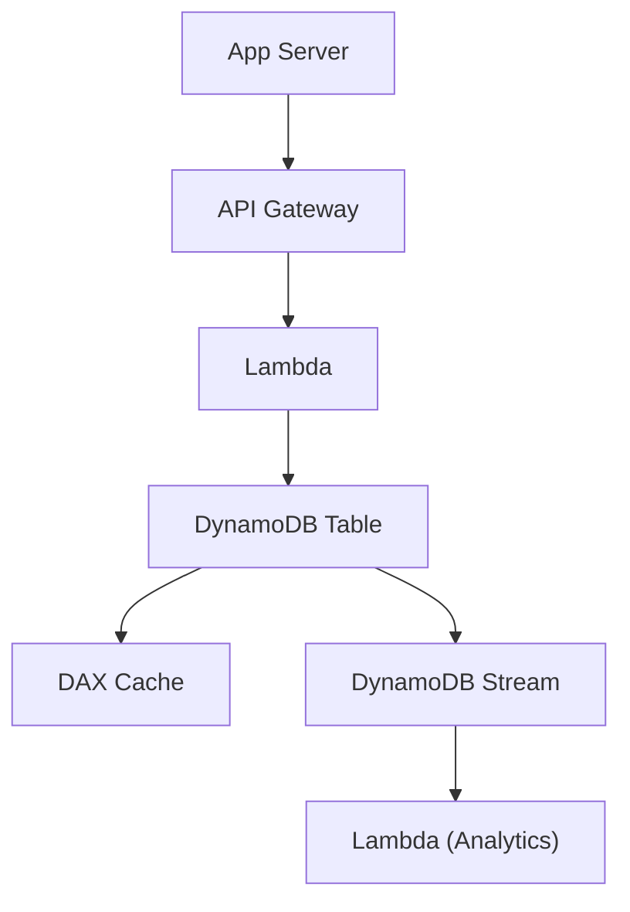

# Amazon DynamoDB - Detailed Overview

## What is DynamoDB?
Amazon DynamoDB is a fully managed NoSQL database service designed for fast and predictable performance at any scale. It is serverless, highly available, and can handle millions of requests per second with single-digit millisecond latency.

## Why Use DynamoDB?
- **Serverless:** No servers to manage, scales automatically.
- **Performance:** Consistent, low-latency reads/writes.
- **Highly available:** Multi-AZ replication by default.
- **Flexible schema:** No need to predefine columns.
- **Integrated with AWS ecosystem:** Streams, Lambda, IAM, etc.

## Core Concepts
### 1. **Tables, Items, and Attributes**
- **Table:** Like a spreadsheet or collection; stores items (rows).
- **Item:** A single record (row) in a table.
- **Attribute:** A field (column) in an item. Items can have different attributes.

### 2. **Primary Keys**
- **Partition Key:** Uniquely identifies each item (e.g., UserID).
- **Composite Key:** Partition Key + Sort Key (e.g., UserID + OrderDate).
- **Best Practice:** Choose keys that distribute data evenly (avoid hot partitions).

### 3. **Indexes**
- **Global Secondary Index (GSI):** Query on non-primary key attributes. Supports different partition/sort keys.
- **Local Secondary Index (LSI):** Same partition key, different sort key. Max 5 per table.
- **Best Practice:** Use GSIs for flexible queries, but monitor write costs and consistency.

### 4. **Capacity Modes**
- **On-Demand:** Pay per request, auto-scales instantly. Great for unpredictable workloads.
- **Provisioned:** Set read/write capacity units (RCUs/WCUs). Use Auto Scaling for dynamic workloads.
- **Best Practice:** Use On-Demand for new/variable workloads, switch to Provisioned for cost optimization.

### 5. **Consistency Models**
- **Eventually Consistent Reads:** Default, fastest, may not reflect latest write.
- **Strongly Consistent Reads:** Always returns latest write, but higher latency and cost.

### 6. **Streams**
- Capture table changes (insert, update, delete) for event-driven architectures.
- Integrate with Lambda for real-time processing, analytics, or replication.

### 7. **Transactions**
- ACID transactions for coordinated, all-or-nothing operations across multiple items/tables.
- Use for financial, inventory, or other critical operations.

### 8. **DAX (DynamoDB Accelerator)**
- In-memory cache for DynamoDB, reduces read latency to microseconds.
- Use for read-heavy, latency-sensitive workloads.

### 9. **Backup & Restore**
- On-demand and continuous backups (point-in-time recovery).
- No performance impact during backup.

## Advanced Features
- **Time to Live (TTL):** Automatically delete expired items.
- **Global Tables:** Multi-region, active-active replication for global apps.
- **Fine-grained IAM:** Control access at table, item, or attribute level.
- **Encryption:** At rest (default, KMS) and in transit (TLS).

## Step-by-Step: Creating a Table (Console)
1. Go to DynamoDB Dashboard in AWS Console.
2. Click "Create table".
3. Enter table name, partition key (and sort key if needed).
4. Choose capacity mode (On-Demand or Provisioned).
5. (Optional) Add indexes, enable streams, TTL, encryption.
6. Create table and start adding items.

## Real-World Example: User Activity Tracking
- Table: `UserActivity` with Partition Key = `UserID`, Sort Key = `Timestamp`.
- Store all user actions, query by user or time range.
- Use GSI for querying by activity type.
- Use Streams + Lambda for real-time analytics.

## Performance Tuning & Best Practices
- **Design for access patterns:** Model tables/keys based on how you query data.
- **Avoid hot partitions:** Use high-cardinality partition keys.
- **Use DAX for caching:** For high read throughput/low latency.
- **Monitor with CloudWatch:** Track throttling, latency, and capacity usage.
- **Use Batch operations:** For efficient bulk reads/writes.
- **Limit item size:** Max 400 KB per item.

## Common Pitfalls & Misconceptions
- **No joins or complex queries:** DynamoDB is not a relational DB.
- **Hot partitions:** Poor key design can cause throttling.
- **Provisioned mode throttling:** Requests above capacity are throttled (use Auto Scaling or On-Demand).
- **GSIs cost extra:** Writes to GSIs consume additional WCUs.

## How DynamoDB Fits in AWS Architectures
- Used for serverless apps, IoT, gaming, mobile backends, real-time analytics, and more.
- Integrates with Lambda, API Gateway, Kinesis, S3, and more.

## Visual Diagram

## Further Reading
- [DynamoDB Documentation](https://docs.aws.amazon.com/amazondynamodb/latest/developerguide/)
- [Best Practices](https://docs.aws.amazon.com/amazondynamodb/latest/developerguide/best-practices.html)
- [Advanced Design Patterns](https://docs.aws.amazon.com/amazondynamodb/latest/developerguide/bp-general-nosql-design.html)
