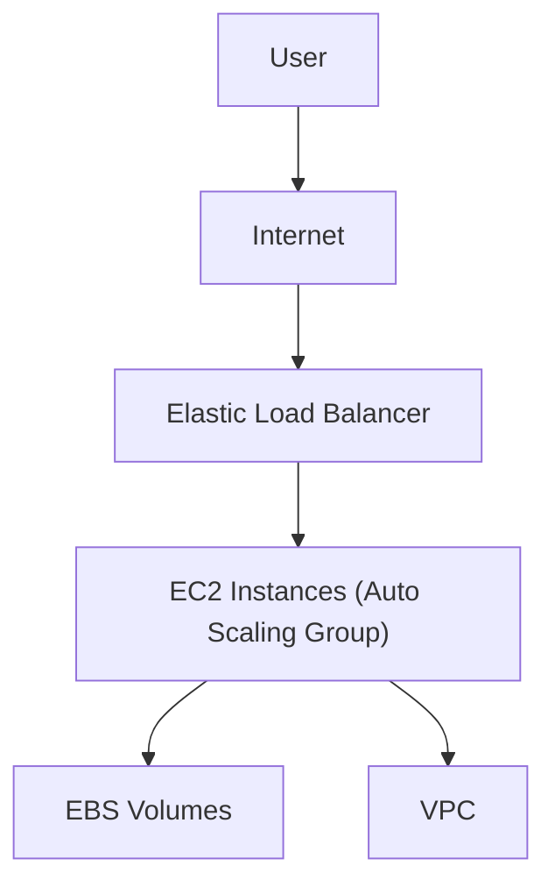

# Amazon EC2 (Elastic Compute Cloud) - Detailed Overview

## What is EC2?
Amazon EC2 is like renting a virtual computer in the cloud. Instead of buying physical servers, you can launch, configure, and manage virtual machines (called "instances") on-demand. EC2 is the backbone of most AWS architectures, providing the compute power for web servers, databases, applications, and more.

## Why Use EC2?
- **No upfront hardware cost:** Pay only for what you use.
- **Scalable:** Launch 1 or 1,000+ instances in minutes.
- **Flexible:** Choose OS, CPU, memory, storage, and networking.
- **Global:** Deploy in any AWS region worldwide.

## Key Concepts
### 1. **Instances**
- A virtual server. You choose the size (CPU, RAM), OS (Linux, Windows), and more.
- Each instance has an "Instance Type" (e.g., t3.micro, m5.large) that defines its resources.

### 2. **Amazon Machine Image (AMI)**
- A template for your instance (OS + pre-installed software).
- AWS provides standard AMIs, or you can create your own.

### 3. **Instance Types & Families**
- **General Purpose (t, m):** Balanced CPU/memory (e.g., t3, m5)
- **Compute Optimized (c):** High CPU (e.g., c5)
- **Memory Optimized (r, x, z):** High RAM (e.g., r5)
- **Storage Optimized (i, d, h):** High disk throughput (e.g., i3)
- **Accelerated Computing (p, g, inf):** GPUs/ML (e.g., p3, g4)

### 4. **Pricing Models**
- **On-Demand:** Pay per second/minute, no commitment. Great for unpredictable workloads.
- **Reserved:** Commit to 1 or 3 years for big discounts. Good for steady-state usage.
- **Spot:** Bid for unused capacity, up to 90% off. Can be interrupted by AWS.
- **Savings Plans:** Flexible, commitment-based savings across instance families.
- **Dedicated Hosts/Instances:** Physical isolation for compliance.

### 5. **Storage Options**
- **EBS (Elastic Block Store):** Persistent, like a hard drive. Survives instance stop/start.
- **Instance Store:** Temporary, fast, but data is lost if the instance stops/terminates.
- **EFS/FSx:** Network file systems for sharing data between instances.

### 6. **Networking**
- **VPC (Virtual Private Cloud):** Your private network in AWS.
- **Subnets:** Segments of your VPC (public/private).
- **Security Groups:** Virtual firewalls for your instances.
- **Elastic IP:** Static public IP address you can attach to an instance.
- **ENI (Elastic Network Interface):** Virtual network card for your instance.

### 7. **Security**
- **Key Pairs:** SSH keys for Linux, passwords for Windows.
- **IAM Roles:** Grant permissions to your instances (e.g., access S3 securely).
- **Security Groups & NACLs:** Control inbound/outbound traffic.

### 8. **Monitoring & Management**
- **CloudWatch:** Monitor CPU, disk, network, and set alarms.
- **CloudTrail:** Log API calls for auditing.
- **Auto Scaling:** Automatically add/remove instances based on demand.
- **Elastic Load Balancer (ELB):** Distribute traffic across instances.

## Step-by-Step: Launching an EC2 Instance
1. **Choose AMI:** Select OS and pre-installed software.
2. **Choose Instance Type:** Pick the right size for your workload.
3. **Configure Instance:** Set network, IAM role, monitoring, etc.
4. **Add Storage:** Attach EBS volumes.
5. **Configure Security Group:** Open required ports (e.g., 22 for SSH, 80 for HTTP).
6. **Launch & Connect:** Use SSH (Linux) or RDP (Windows) to access your instance.

## Real-World Example: Web Application
- **Frontend:** EC2 instances in public subnet, behind an ELB.
- **Backend:** EC2 or RDS in private subnet.
- **Storage:** S3 for static files, EBS for persistent data.
- **Scaling:** Auto Scaling Group adjusts number of EC2s based on traffic.

## Common Pitfalls & Misconceptions
- **Public IPs:** Stopping/starting an instance changes its public IP unless you use an Elastic IP.
- **Data Loss:** Instance Store data is lost on stop/terminate. Use EBS for persistence.
- **Security:** Never use the root account for daily tasks. Use IAM roles and least privilege.
- **SSH Access:** Restrict SSH to trusted IPs, or use SSM Session Manager for secure access.

## How EC2 Fits in AWS Architectures
- EC2 is the compute engine for most AWS solutions: web servers, app servers, batch jobs, ML, and more.
- Often used with S3 (storage), RDS (database), VPC (network), and IAM (security).

## Visual Diagram

## Further Reading
- [AWS EC2 Documentation](https://docs.aws.amazon.com/ec2/)
- [EC2 Pricing](https://aws.amazon.com/ec2/pricing/)
- [Best Practices](https://docs.aws.amazon.com/AWSEC2/latest/UserGuide/ec2-best-practices.html)
