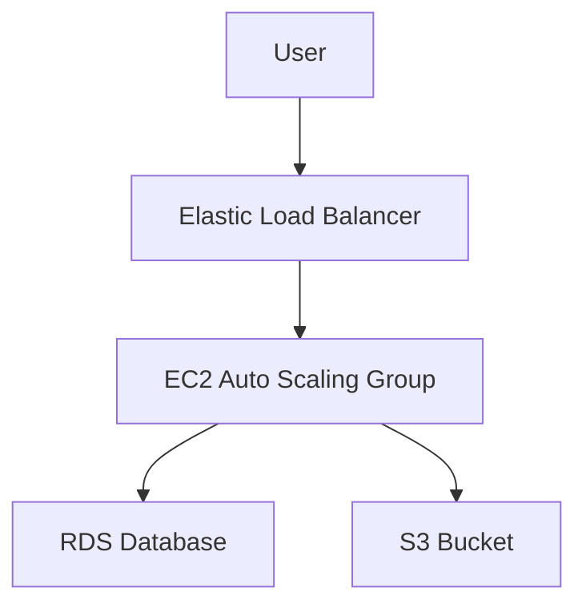

# EC2 Use Cases

## 1. Web Application Hosting
- Deploy scalable web servers behind an ELB in multiple AZs.
- Use Auto Scaling for elasticity.
- Store static assets in S3, use CloudFront for CDN.

## 2. Batch Processing
- Use Spot Instances for cost-effective compute.
- Use S3 for input/output data.

## 3. High Performance Computing (HPC)
- Use compute-optimized or GPU instances.
- Use Placement Groups for low latency.

## 4. Development/Test Environments
- Quickly spin up and tear down environments.
- Use AMIs for consistent setup.

## 5. Machine Learning
- Use GPU instances for training models.
- Use EBS for persistent storage.

## 6. Hybrid Architectures
- Use Direct Connect or VPN for on-premises integration.

## Architecture Pattern Example

