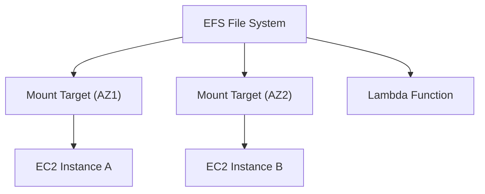

# Amazon EFS (Elastic File System) - Detailed Overview

## What is EFS?
Amazon EFS is a fully managed, scalable, elastic, cloud-native file system that you can mount from multiple EC2 instances (and other services) using the NFS protocol. It grows and shrinks automatically as you add or remove files.

## Why Use EFS?
- **Shared storage:** Multiple EC2 instances (and containers, Lambda) can access the same files at the same time.
- **Elastic:** Automatically scales from gigabytes to petabytes.
- **Fully managed:** No servers or storage to manage.
- **POSIX-compliant:** Works like a traditional Linux file system.
- **Highly available and durable:** Data is stored across multiple AZs.

## Core Architecture
- **NFSv4.1/4.0 protocol:** Mount EFS as a network file system on Linux.
- **Regional service:** Data is stored across all AZs in a region.
- **Elastic:** No need to provision storage; pay for what you use.
- **Mount targets:** One per AZ for high availability and performance.

## Key Features
### 1. **Performance Modes**
- **General Purpose:** Default, low latency, suitable for most workloads.
- **Max I/O:** Higher throughput, higher latency, for highly parallel workloads (e.g., big data, media processing).

### 2. **Throughput Modes**
- **Bursting:** Throughput scales with storage size (default).
- **Provisioned:** Set a specific throughput regardless of storage size.

### 3. **Storage Classes**
- **Standard:** For frequently accessed files.
- **Infrequent Access (IA):** Lower cost for files not accessed often. EFS automatically moves files between classes based on access patterns.

### 4. **Security**
- **VPC integration:** EFS is accessible only from your VPC.
- **Security groups:** Control network access to mount targets.
- **IAM policies:** Control API access.
- **Encryption:** At rest (KMS) and in transit (TLS).

## Step-by-Step: Creating and Mounting an EFS File System (Console)
1. Go to the EFS Dashboard in AWS Console.
2. Click "Create file system".
3. Choose VPC, subnets, and security groups.
4. (Optional) Enable encryption, set performance and throughput modes.
5. Create the file system.
6. On your EC2 instance, install the NFS client and mount the EFS file system using the DNS name provided.

## Real-World Example: Web Server Farm
- Multiple EC2 web servers mount the same EFS file system to share user uploads and website assets.
- EFS provides a single source of truth for files, with high availability and durability.

## Advanced Features & Best Practices
- **Use General Purpose mode for most workloads; Max I/O for parallel, high-throughput needs.**
- **Enable automatic backups for disaster recovery.**
- **Use EFS Access Points for fine-grained access control.**
- **Monitor with CloudWatch for throughput, IOPS, and burst credits.**
- **Use lifecycle management to move infrequently accessed files to IA storage class.**

## Common Pitfalls & Misconceptions
- **EFS is not for Windows:** Only supports NFS (Linux/Unix).
- **Performance depends on file system size (burst mode):** Small file systems have lower throughput.
- **Mount targets must be in each AZ for high availability.**
- **EFS is not a block storage (use EBS) or object storage (use S3).**

## How EFS Fits in AWS Architectures
- EFS is ideal for shared storage in web farms, container clusters (ECS/EKS), analytics, and home directories.
- Integrates with EC2, Lambda, ECS, EKS, and more.

## Visual Diagram

## Further Reading
- [EFS Documentation](https://docs.aws.amazon.com/efs/)
- [Best Practices](https://docs.aws.amazon.com/efs/latest/ug/best-practices.html)
- [Performance Tuning](https://docs.aws.amazon.com/efs/latest/ug/performance.html)
