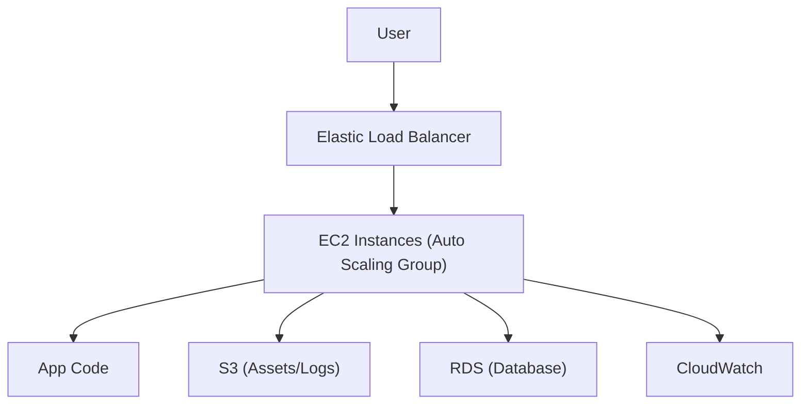

# AWS Elastic Beanstalk - Detailed Overview

## What is Elastic Beanstalk?
AWS Elastic Beanstalk is a fully managed service for deploying and scaling web applications and services. It handles the provisioning, load balancing, scaling, and monitoring of the infrastructure, so you can focus on your code.

## Why Use Elastic Beanstalk?
- **Easy deployment:** Deploy code with a few clicks or CLI commands
- **Managed infrastructure:** AWS handles servers, load balancers, scaling, and patching
- **Supports multiple platforms:** Java, .NET, Node.js, Python, Ruby, Go, PHP, Docker, and more
- **Integrated with AWS:** Works with RDS, S3, VPC, IAM, CloudWatch, CodePipeline, and more
- **Customizable:** Full control over environment configuration if needed

## Core Concepts
### 1. **Application & Environment**
- **Application:** Logical collection of environments, versions, and configurations
- **Environment:** Single deployment of an application version (Web Server or Worker)
- **Environment Tier:** Web Server (HTTP/S) or Worker (background jobs via SQS)

### 2. **Platform**
- Pre-configured stack (OS, runtime, web server, etc.) for your language/framework
- Supports custom platforms via Docker or Packer

### 3. **Deployment Models**
- **All at once:** Fast, but downtime during deployment
- **Rolling:** Deploys in batches, reduces downtime
- **Rolling with additional batch:** Maintains full capacity during deployment
- **Immutable:** Deploys to new instances, then swaps CNAME (zero downtime)
- **Blue/Green:** Deploys to a new environment, then swaps CNAME (safe rollback)

### 4. **Scaling & Load Balancing**
- Auto Scaling Groups and Elastic Load Balancers are managed by Beanstalk
- Configure min/max/desired instance counts and scaling triggers

### 5. **Configuration & Customization**
- Use configuration files (`.ebextensions`) for advanced setup
- Customize environment variables, instance types, VPC, security groups, etc.

### 6. **Health Monitoring**
- Monitors environment health (Ok, Warning, Degraded, Severe)
- Integrates with CloudWatch for metrics and alarms

## Step-by-Step: Deploying an App (Console)
1. Go to the Elastic Beanstalk Dashboard in AWS Console
2. Click "Create Application"
3. Choose platform (e.g., Node.js, Python, Docker)
4. Upload your code or connect to a repository
5. Configure environment (instance type, scaling, VPC, etc.)
6. Launch environment and monitor health

## Real-World Example: Scalable Web App
- Deploy a Node.js app to Elastic Beanstalk
- Beanstalk provisions EC2, ELB, Auto Scaling, and CloudWatch
- App scales automatically based on CPU or request count
- Use RDS for database, S3 for static assets

## Advanced Features & Best Practices
- **Use immutable or blue/green deployments for zero downtime**
- **Store configuration in `.ebextensions` for repeatability**
- **Monitor health and set up CloudWatch alarms**
- **Use environment variables for secrets/config**
- **Integrate with CodePipeline for CI/CD**
- **Regularly update platform versions for security**

## Common Pitfalls & Misconceptions
- **Environment updates can cause downtime (use rolling/immutable/blue-green)**
- **Default security groups may be too open—harden as needed**
- **Logs are not retained by default—enable log streaming to S3/CloudWatch**
- **Customizations may be overwritten by platform updates**

## How Elastic Beanstalk Fits in AWS Architectures
- Beanstalk is ideal for web apps, APIs, and background workers needing managed infrastructure
- Integrates with RDS, S3, VPC, IAM, CloudWatch, CodePipeline, and more

## Visual Diagram

## Further Reading
- [Elastic Beanstalk Documentation](https://docs.aws.amazon.com/elasticbeanstalk/latest/dg/Welcome.html)
- [Best Practices](https://docs.aws.amazon.com/elasticbeanstalk/latest/dg/using-features.managing.env-tiers.html)
