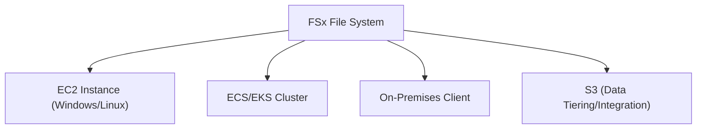

# Amazon FSx - Detailed Overview

## What is Amazon FSx?
Amazon FSx is a family of fully managed, high-performance file systems built for a variety of workloads. FSx offers four options:
- **FSx for Windows File Server:** Native Windows file system (SMB, AD integration)
- **FSx for Lustre:** High-performance, parallel file system for compute-intensive workloads
- **FSx for NetApp ONTAP:** Enterprise-grade features, multi-protocol (NFS, SMB, iSCSI)
- **FSx for OpenZFS:** Open-source ZFS file system for Linux workloads

## Why Use FSx?
- **Managed file systems:** No hardware or software to manage
- **Performance:** High throughput and low latency
- **Integration:** Works with EC2, ECS, EKS, on-premises, and more
- **Choice:** Pick the right file system for your workload

## Core Architecture
- **FSx for Windows:** SMB protocol, Active Directory integration, Windows ACLs, multi-AZ HA
- **FSx for Lustre:** POSIX-compliant, parallel I/O, integrates with S3 for fast data movement
- **FSx for NetApp ONTAP:** Multi-protocol, snapshots, cloning, tiering to S3, data protection
- **FSx for OpenZFS:** Snapshots, clones, compression, data integrity, NFS protocol

## Key Features
### 1. **FSx for Windows File Server**
- Fully managed Windows file shares (SMB)
- Active Directory (AD) integration for authentication and access control
- Multi-AZ deployment for high availability
- Data deduplication, shadow copies, and backups

### 2. **FSx for Lustre**
- High-performance, parallel file system for HPC, ML, analytics
- Seamless integration with S3 (import/export data)
- Sub-millisecond latencies, hundreds of GB/s throughput

### 3. **FSx for NetApp ONTAP**
- Multi-protocol (NFS, SMB, iSCSI)
- Snapshots, cloning, data tiering to S3
- Advanced data management and protection features

### 4. **FSx for OpenZFS**
- Open-source ZFS file system for Linux
- Snapshots, clones, compression, data integrity
- NFS protocol, high throughput

## Step-by-Step: Creating an FSx File System (Console)
1. Go to the FSx Dashboard in AWS Console.
2. Click "Create file system".
3. Choose the file system type (Windows, Lustre, ONTAP, OpenZFS).
4. Configure storage, throughput, and network settings.
5. (Optional) Set up AD integration, S3 data repository, or advanced features.
6. Launch and mount from EC2 or on-premises clients.

## Real-World Examples
- **FSx for Windows:** Shared storage for Windows-based applications, user home directories
- **FSx for Lustre:** HPC, genomics, ML training, big data analytics
- **FSx for NetApp ONTAP:** Enterprise NAS, multi-protocol data sharing, DR
- **FSx for OpenZFS:** Linux app data, DevOps, analytics

## Advanced Features & Best Practices
- **Choose the right FSx type for your workload**
- **Use multi-AZ for high availability (Windows, ONTAP)**
- **Integrate with S3 for cost-effective tiering (Lustre, ONTAP)**
- **Monitor with CloudWatch for performance and health**
- **Enable encryption at rest and in transit**
- **Automate backups and test restores**

## Common Pitfalls & Misconceptions
- **FSx for Windows is not for Linux clients (use Lustre, ONTAP, or OpenZFS)**
- **FSx for Lustre is not a general-purpose file system (for HPC/analytics only)**
- **FSx for ONTAP and OpenZFS require understanding of advanced features**
- **Network configuration (VPC, security groups) is critical for access**

## How FSx Fits in AWS Architectures
- FSx provides managed file storage for Windows, Linux, HPC, analytics, and enterprise workloads
- Integrates with EC2, ECS, EKS, on-premises, and S3

## Visual Diagram

## Further Reading
- [FSx Documentation](https://docs.aws.amazon.com/fsx/)
- [Choosing an FSx File System](https://docs.aws.amazon.com/fsx/latest/UserGuide/what-is.html)
- [Best Practices](https://docs.aws.amazon.com/fsx/latest/WindowsGuide/best-practices.html)
