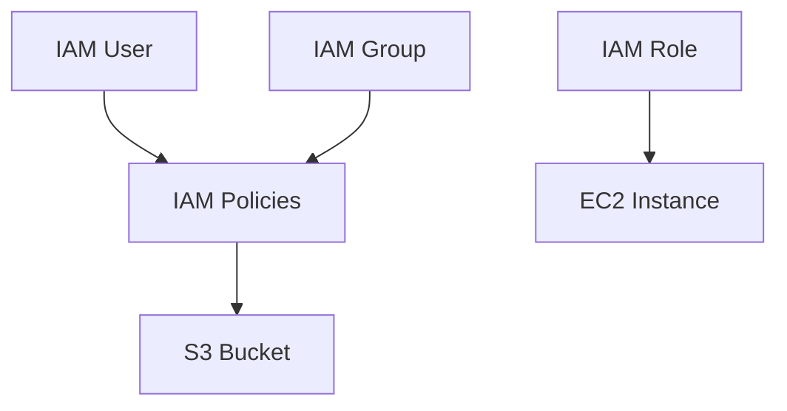

# AWS IAM (Identity and Access Management) - Detailed Overview

## What is IAM?
IAM is like the security guard and keymaster for your AWS account. It lets you control who can do what in your AWS environment—who can log in, what resources they can access, and what actions they can perform.

## Why Use IAM?
- **Security:** Protect your AWS resources from unauthorized access.
- **Granular control:** Give each user/service only the permissions they need.
- **Auditability:** Track who did what, when, and from where.
- **Scalability:** Manage permissions for many users and services easily.

## Key Concepts
### 1. **Users**
- Individual identities (people, apps) with credentials (password, access keys).
- Used for human access (console, CLI, SDK).

### 2. **Groups**
- Collections of users with shared permissions (e.g., Admins, Developers).
- Assign policies to groups for easier management.

### 3. **Roles**
- Identities with permissions that can be assumed by users, AWS services (EC2, Lambda), or external identities (SSO, federated login).
- Used for cross-account access, service-to-service permissions, and temporary credentials.

### 4. **Policies**
- JSON documents that define what actions are allowed/denied on which resources.
- **Managed policies:** AWS or customer managed, reusable.
- **Inline policies:** Attached to a single user/group/role.

### 5. **MFA (Multi-Factor Authentication)**
- Adds an extra layer of security (e.g., password + code from phone app).

### 6. **Access Keys**
- Used for programmatic access (CLI, SDK). Should be rotated regularly and never hardcoded.

### 7. **Service Control Policies (SCPs)**
- Organization-wide guardrails (require AWS Organizations).

## Step-by-Step: Creating a User and Assigning Permissions (Console)
1. Go to the IAM Dashboard in AWS Console.
2. Click "Users" > "Add user".
3. Enter username, select access type (console, programmatic, or both).
4. Attach policies directly or add to a group.
5. (Optional) Enable MFA.
6. Download credentials and share securely.

## Real-World Example: EC2 Access
- Create a group "Developers" with permissions to launch/terminate EC2 instances.
- Add users to the group.
- Use IAM roles for EC2 instances to access S3 securely (no hardcoded keys).

## Common Pitfalls & Misconceptions
- **Root user:** Has full access—use only for account setup, then lock away.
- **Over-permissioning:** Granting more permissions than needed (avoid using AdministratorAccess unless necessary).
- **Not using MFA:** Increases risk of account compromise.
- **Hardcoding access keys:** Use IAM roles for AWS services instead.

## How IAM Fits in AWS Architectures
- IAM is the foundation of AWS security.
- Used to control access for users, services, and applications.
- Integrates with every AWS service.

## Visual Diagram

## Further Reading
- [AWS IAM Documentation](https://docs.aws.amazon.com/iam/)
- [IAM Best Practices](https://docs.aws.amazon.com/IAM/latest/UserGuide/best-practices.html)
