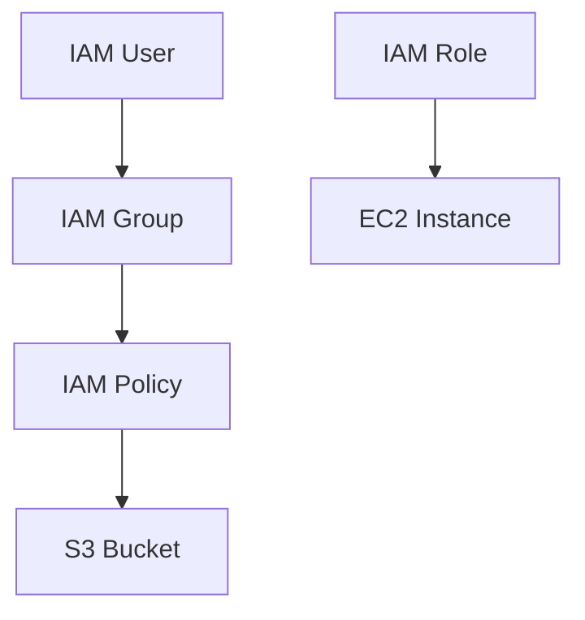

# IAM Use Cases

## 1. User and Group Management
- Create users for individuals, assign to groups for shared permissions.

## 2. Service-to-Service Permissions
- Use IAM roles for EC2, Lambda, ECS to access other AWS services securely.

## 3. Cross-Account Access
- Use roles with trust policies to allow access from other AWS accounts.

## 4. Federated Access
- Integrate with SAML, OIDC, or social identity providers for SSO.

## 5. Permission Guardrails
- Use Service Control Policies (SCPs) in AWS Organizations.

## Architecture Pattern Example

