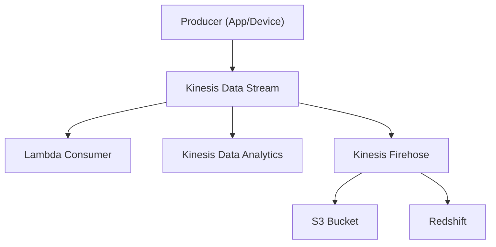

# Amazon Kinesis - Detailed Overview

## What is Kinesis?
Amazon Kinesis is a fully managed platform for real-time streaming data ingestion, processing, and analysis. It enables you to collect, process, and analyze data streams at massive scale, in real time.

## Why Use Kinesis?
- **Real-time analytics:** Process data as it arrives (not batch)
- **Scalable:** Handles gigabytes/second and millions of records per second
- **Integrated with AWS:** Works with Lambda, S3, Redshift, EMR, Glue, and more
- **Multiple services:** Choose the right tool for your use case (Streams, Firehose, Analytics, Video Streams)

## Core Services
### 1. **Kinesis Data Streams (KDS)**
- Real-time, low-latency streaming data ingestion
- Data is stored in shards (scalable units of throughput)
- Retention: 24 hours (default), up to 7 days (extended retention)
- Producers write to streams, consumers (apps, Lambda, KCL) read from streams

### 2. **Kinesis Data Firehose**
- Fully managed delivery of streaming data to S3, Redshift, OpenSearch, Splunk, HTTP endpoints
- Supports data transformation with Lambda
- No need to manage shards or scaling
- Near real-time (buffering, not true streaming)

### 3. **Kinesis Data Analytics**
- Real-time SQL queries and analytics on streaming data (from KDS or Firehose)
- Supports windowed aggregations, joins, and more

### 4. **Kinesis Video Streams**
- Ingest, store, and process video streams for analytics, ML, and playback

## Key Concepts
- **Shard:** Unit of throughput in KDS (1 MB/s in, 2 MB/s out, 1,000 records/sec)
- **Partition key:** Used to group data by shard
- **Retention:** How long data is stored in the stream (default 24h, up to 7d)
- **Enhanced fan-out:** Dedicated throughput per consumer (KDS)
- **Scaling:** Add/remove shards to scale throughput

## Security
- **IAM policies:** Control access to streams and records
- **Server-side encryption:** Encrypt data at rest with KMS
- **VPC endpoints:** Private connectivity to Kinesis
- **Data transformation:** Use Lambda for filtering, enrichment, and format conversion

## Step-by-Step: Creating a Data Stream (Console)
1. Go to the Kinesis Dashboard in AWS Console
2. Click "Create data stream"
3. Enter stream name and number of shards
4. Configure retention, encryption, and monitoring
5. Create the stream and note the ARN
6. Use SDK/CLI to put and get records

## Real-World Example: Real-Time Log Analytics
- Web servers send logs to Kinesis Data Streams
- Lambda or Kinesis Data Analytics processes logs in real time
- Firehose delivers processed data to S3 and Redshift for storage and reporting

## Advanced Features & Best Practices
- **Use enhanced fan-out for high-throughput consumers**
- **Monitor shard metrics and scale as needed**
- **Use partition keys to distribute load evenly**
- **Encrypt data at rest and in transit**
- **Integrate with Lambda for serverless processing**
- **Use Firehose for easy delivery to S3/Redshift/OpenSearch**

## Common Pitfalls & Misconceptions
- **Shard limits:** Exceeding limits causes throttling (ProvisionedThroughputExceeded)
- **Data loss:** Data is lost if not read before retention expires
- **Firehose is not true streaming (buffered delivery)**
- **Scaling requires resharding (KDS)**

## How Kinesis Fits in AWS Architectures
- Kinesis is the default service for real-time streaming data ingestion and analytics
- Used for log analytics, IoT, clickstreams, ML, video, and more
- Integrates with Lambda, S3, Redshift, EMR, Glue, and more

## Visual Diagram

## Further Reading
- [Kinesis Documentation](https://docs.aws.amazon.com/streams/latest/dev/introduction.html)
- [Best Practices](https://docs.aws.amazon.com/streams/latest/dev/best-practices.html)
