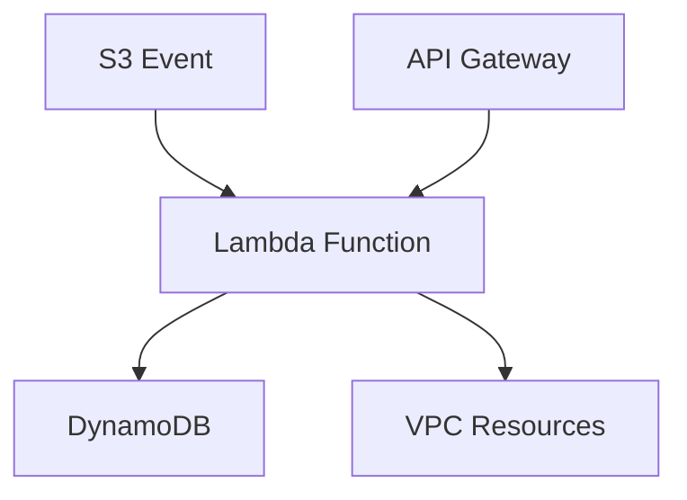

# AWS Lambda - Detailed Overview

## What is Lambda?
AWS Lambda is like a magic butler for your code: you give it a function, and it runs it for you whenever you need—no servers to manage, no infrastructure to worry about. Lambda is the core of "serverless" computing on AWS.

## Why Use Lambda?
- **No servers to manage:** AWS handles all the infrastructure.
- **Automatic scaling:** Runs your code in response to events, scales instantly.
- **Pay only for what you use:** Billed by the millisecond.
- **Integrates with 200+ AWS services and SaaS apps.**

## Key Concepts
### 1. **Functions**
- Your code, packaged and uploaded to Lambda.
- Supports Node.js, Python, Java, Go, .NET, Ruby, and custom runtimes.

### 2. **Event Sources (Triggers)**
- Lambda runs your code in response to events:
  - S3 (file uploads)
  - API Gateway (HTTP requests)
  - DynamoDB Streams
  - SQS, SNS, EventBridge, CloudWatch Events, and more

### 3. **Execution Environment**
- Lambda creates a secure, isolated environment for each invocation.
- Max execution time: 15 minutes per request.
- Memory: 128 MB to 10,240 MB (10 GB).

### 4. **Statelessness**
- No persistent local storage between invocations.
- Use S3, DynamoDB, or EFS for persistent data.

### 5. **Environment Variables & Layers**
- Pass configuration to your function via environment variables.
- Use Lambda Layers to share code/libraries across functions.

### 6. **VPC Integration**
- Run Lambda inside your VPC to access private resources (e.g., RDS, EC2).

### 7. **Security**
- **IAM Roles:** Grant permissions to your function (e.g., access S3, DynamoDB).
- **Encryption:** Environment variables can be encrypted with KMS.

## Step-by-Step: Creating a Lambda Function (Console)
1. Go to the Lambda Dashboard in AWS Console.
2. Click "Create function".
3. Choose "Author from scratch" or use a blueprint.
4. Name your function, select runtime (e.g., Python 3.9).
5. Set permissions (create or use an IAM role).
6. Write or upload your code.
7. Add a trigger (e.g., S3, API Gateway).
8. Test your function with sample events.

## Real-World Example: Image Processing
- User uploads a photo to S3.
- S3 triggers a Lambda function.
- Lambda resizes the image and stores the result in another S3 bucket.

## Common Pitfalls & Misconceptions
- **Cold starts:** First invocation after idle may be slower.
- **Timeouts:** Max 15 minutes per invocation.
- **No local persistence:** Use S3/EFS for files, DynamoDB for state.
- **IAM permissions:** Functions need explicit permissions for AWS resources.

## How Lambda Fits in AWS Architectures
- Lambda is the compute engine for serverless architectures.
- Used for APIs (with API Gateway), automation, data processing, scheduled jobs, and more.
- Integrates with S3, DynamoDB, SQS, SNS, and almost every AWS service.

## Visual Diagram

## Further Reading
- [AWS Lambda Documentation](https://docs.aws.amazon.com/lambda/)
- [Serverless Best Practices](https://docs.aws.amazon.com/lambda/latest/dg/best-practices.html)
