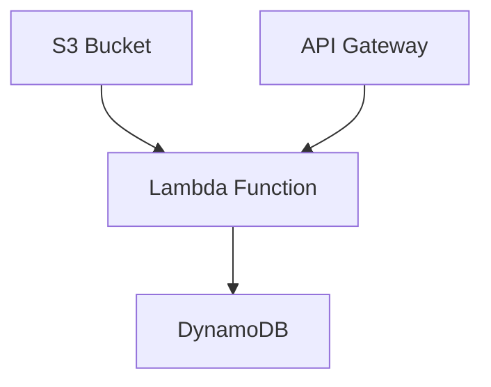

# Lambda Use Cases

## 1. Real-Time File Processing
- Triggered by S3 uploads (e.g., image resizing, data transformation).

## 2. REST APIs
- Use with API Gateway to build serverless APIs.

## 3. Automation
- Scheduled tasks with EventBridge (CloudWatch Events).
- Infrastructure automation (e.g., resource cleanup).

## 4. Data Transformation
- Process Kinesis or DynamoDB Streams.

## 5. IoT Backends
- Handle device data ingestion and processing.

## Architecture Pattern Example

