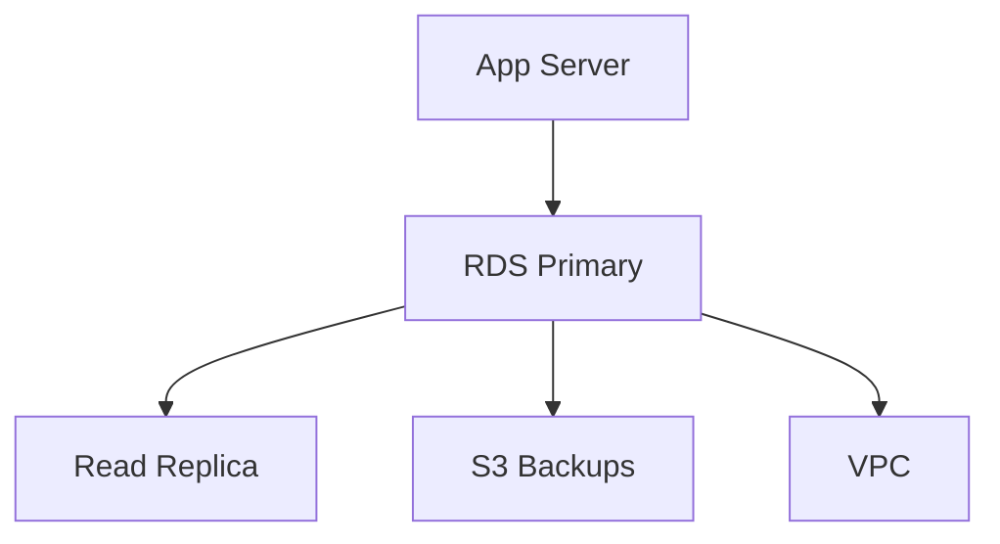

# Amazon RDS (Relational Database Service) - Detailed Overview

## What is RDS?
Amazon RDS is like having a database admin in the cloud. It lets you run popular relational databases (like MySQL, PostgreSQL, MariaDB, Oracle, SQL Server, and Aurora) without worrying about hardware, patching, or backups. AWS manages the heavy lifting so you can focus on your data and applications.

## Why Use RDS?
- **Managed service:** AWS handles backups, patching, and failover.
- **Scalable:** Easily increase storage and compute as your needs grow.
- **High availability:** Multi-AZ deployments for automatic failover.
- **Secure:** Encryption at rest and in transit, VPC integration, IAM authentication.
- **Supports multiple engines:** MySQL, PostgreSQL, MariaDB, Oracle, SQL Server, Aurora.

## Key Concepts
### 1. **DB Instance**
- The database server you launch in RDS.
- Each instance runs one database engine (e.g., MySQL).

### 2. **DB Engine**
- The type of database (MySQL, PostgreSQL, etc.).
- Aurora is AWS’s cloud-native, MySQL/PostgreSQL-compatible engine.

### 3. **Storage Types**
- **General Purpose (SSD):** Balanced price/performance.
- **Provisioned IOPS (SSD):** High performance for critical workloads.
- **Magnetic:** Legacy, rarely used.

### 4. **Multi-AZ Deployments**
- RDS automatically creates a standby replica in another AZ.
- Automatic failover if the primary instance fails.

### 5. **Read Replicas**
- Copies of your database for read scaling (MySQL, PostgreSQL, MariaDB, Aurora).
- Not automatic failover (except Aurora).

### 6. **Backups & Snapshots**
- **Automated backups:** Daily snapshots + transaction logs (7–35 days retention).
- **Manual snapshots:** User-initiated, kept until deleted.

### 7. **Security**
- **VPC integration:** Place DBs in private subnets.
- **IAM authentication:** For MySQL and PostgreSQL.
- **Encryption:** At rest (KMS) and in transit (SSL/TLS).
- **Security groups:** Control inbound/outbound access.

## Step-by-Step: Launching an RDS Instance (Console)
1. Go to the RDS Dashboard in AWS Console.
2. Click "Create database".
3. Choose engine (e.g., MySQL), version, and template (production/dev/test).
4. Set DB instance size, storage, and Multi-AZ if needed.
5. Set master username/password.
6. Choose VPC, subnet, and security group.
7. Configure backups, monitoring, and maintenance.
8. Launch and connect using endpoint, username, and password.

## Real-World Example: Web App Database
- Web servers (EC2, Lambda) connect to RDS in a private subnet.
- Multi-AZ for high availability.
- Read replicas for reporting/analytics.
- Automated backups for disaster recovery.

## Common Pitfalls & Misconceptions
- **Single-AZ = no automatic failover:** Use Multi-AZ for production.
- **Read replicas are not for failover (except Aurora).**
- **Backups are deleted when the instance is deleted (unless you keep snapshots).**
- **Encryption must be enabled at creation.**

## How RDS Fits in AWS Architectures
- RDS is the go-to managed database for web/mobile apps, analytics, and business applications.
- Used with EC2, Lambda, VPC, and IAM for secure, scalable solutions.

## Visual Diagram

## Further Reading
- [AWS RDS Documentation](https://docs.aws.amazon.com/rds/)
- [RDS Best Practices](https://docs.aws.amazon.com/AmazonRDS/latest/UserGuide/CHAP_BestPractices.html)
