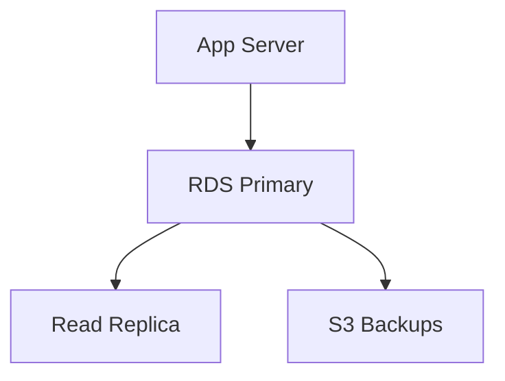

# RDS Use Cases

## 1. Web/Mobile Application Database
- Use Multi-AZ for high availability.
- Use read replicas for scaling reads.

## 2. Analytics
- Use read replicas for reporting/analytics workloads.

## 3. Disaster Recovery
- Automated backups and cross-region snapshots.

## 4. Business Applications
- Managed Oracle, SQL Server, PostgreSQL, MySQL, MariaDB.

## Architecture Pattern Example

