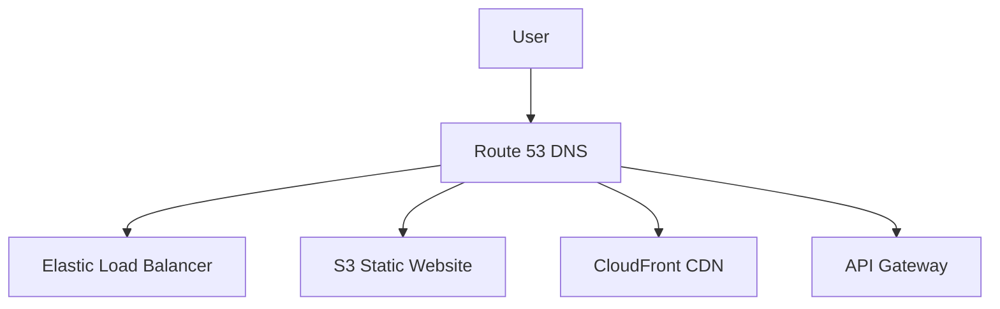

# Amazon Route 53 - Detailed Overview

## What is Route 53?
Amazon Route 53 is a highly available and scalable Domain Name System (DNS) web service. It connects user requests to infrastructure running in AWS (like EC2, ELB, S3) and outside AWS, and can also be used to register domain names.

## Why Use Route 53?
- **Global DNS:** Fast, reliable DNS resolution worldwide
- **Domain registration:** Buy and manage domains directly in AWS
- **Advanced routing:** Control traffic with health checks, failover, latency, geolocation, and more
- **Highly available:** Built on AWS’s global infrastructure
- **Integrated with AWS services:** ELB, S3, CloudFront, API Gateway, etc.

## Core Concepts
### 1. **DNS Basics**
- **DNS:** Translates human-friendly names (e.g., www.example.com) to IP addresses
- **Hosted Zone:** Container for DNS records for a domain
- **Record Set:** Mapping from a domain/subdomain to a resource (A, AAAA, CNAME, MX, TXT, etc.)

### 2. **Routing Policies**
- **Simple:** Standard DNS record (one value)
- **Weighted:** Split traffic by percentage across multiple resources
- **Latency:** Route to the region with the lowest latency for the user
- **Failover:** Route to healthy resources, fail over if unhealthy
- **Geolocation:** Route based on user’s geographic location
- **Geoproximity:** Route based on geographic bias (requires Traffic Flow)
- **Multi-value Answer:** Return multiple healthy records (basic load balancing)

### 3. **Health Checks**
- Monitor endpoint health (HTTP, TCP, HTTPS)
- Can be used to remove unhealthy endpoints from DNS responses
- Integrate with CloudWatch Alarms

### 4. **Domain Registration**
- Register and manage domains directly in Route 53
- Supports WHOIS privacy, DNSSEC, and auto-renewal

### 5. **Traffic Flow**
- Visual editor for complex routing policies (combining latency, geolocation, failover, etc.)

### 6. **Security**
- **DNSSEC:** Protects against DNS spoofing (signs DNS records)
- **IAM policies:** Control who can manage DNS records
- **Query logging:** Log DNS queries for auditing and troubleshooting

## Step-by-Step: Creating a Hosted Zone and Record (Console)
1. Go to the Route 53 Dashboard in AWS Console
2. Click "Hosted zones" > "Create hosted zone"
3. Enter your domain name and type (public/private)
4. Add record sets (A, CNAME, MX, etc.) for your resources
5. (Optional) Set routing policy, health checks, and TTL
6. Update your domain registrar to use Route 53 name servers

## Real-World Example: Highly Available Web App
- Use weighted routing to split traffic between two EC2 instances in different regions
- Use health checks to automatically remove unhealthy endpoints
- Use latency routing to direct users to the closest region
- Register and manage your domain in Route 53

## Advanced Features & Best Practices
- **Use health checks for failover and high availability**
- **Combine routing policies for complex traffic management**
- **Enable DNSSEC for domain security**
- **Monitor DNS queries with query logging**
- **Automate DNS changes with CloudFormation or Route 53 API**

## Common Pitfalls & Misconceptions
- **TTL impacts failover speed:** Lower TTL for faster failover, but more DNS queries
- **CNAME at the root domain is not allowed (use ALIAS record in Route 53)**
- **Health checks are billed separately**
- **Propagation delay:** DNS changes can take time to propagate globally

## How Route 53 Fits in AWS Architectures
- Route 53 is the entry point for most AWS web applications
- Used for global load balancing, failover, and domain management
- Integrates with ELB, CloudFront, S3, API Gateway, and more

## Visual Diagram

## Further Reading
- [Route 53 Documentation](https://docs.aws.amazon.com/Route53/latest/DeveloperGuide/)
- [Routing Policies](https://docs.aws.amazon.com/Route53/latest/DeveloperGuide/routing-policy.html)
- [Best Practices](https://docs.aws.amazon.com/Route53/latest/DeveloperGuide/best-practices.html)
