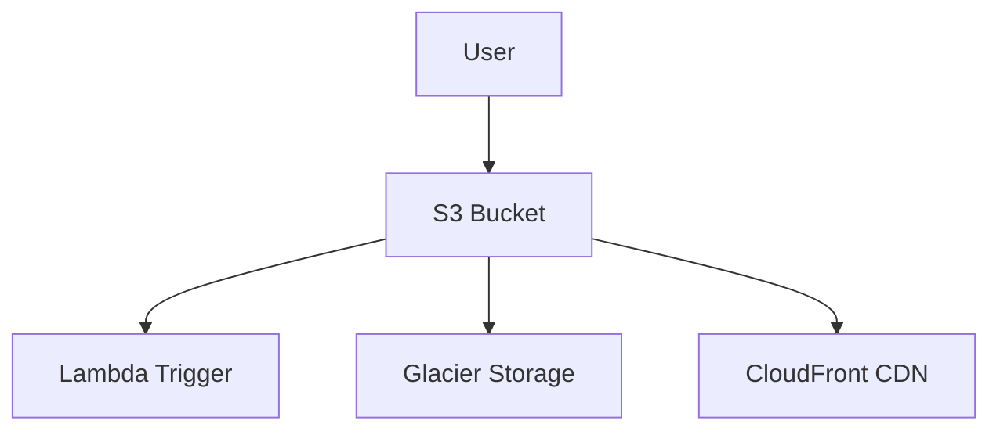

# Amazon S3 (Simple Storage Service) - Detailed Overview

## What is S3?
Amazon S3 is like a giant, secure, internet-based hard drive. It lets you store and retrieve any amount of data, at any time, from anywhere on the web. S3 is used for everything from website images to backups, big data, and more.

## Why Use S3?
- **Unlimited storage:** Store as much as you want, from a few bytes to petabytes.
- **Highly durable:** 99.999999999% (11 9's) durability—your data is safe.
- **Accessible:** Access from anywhere via web, CLI, SDK, or API.
- **Cost-effective:** Pay only for what you use, with multiple storage classes for different needs.

## Key Concepts
### 1. **Buckets**
- Like folders at the top level. Every object (file) lives in a bucket.
- Bucket names are globally unique (e.g., mycompany-website-images).

### 2. **Objects**
- The files you store (images, videos, backups, etc.).
- Each object has a key (its unique name in the bucket).

### 3. **Storage Classes**
- **Standard:** For frequently accessed data.
- **Intelligent-Tiering:** Automatically moves data to cheaper storage if not accessed.
- **Standard-IA (Infrequent Access):** For data you access less often.
- **One Zone-IA:** Cheaper, but stored in one AZ only.
- **Glacier/Glacier Deep Archive:** For long-term, archival storage (retrieval takes minutes/hours).

### 4. **Versioning**
- Keep multiple versions of an object (protects against accidental deletes/overwrites).
- Must be enabled per bucket.

### 5. **Lifecycle Policies**
- Automate moving data between storage classes or deleting old files.
- Example: Move logs to Glacier after 30 days, delete after 1 year.

### 6. **Access Control**
- **IAM Policies:** Control access at the user/role level.
- **Bucket Policies:** Control access at the bucket level (JSON documents).
- **ACLs:** Legacy, less recommended.
- **Block Public Access:** Prevents accidental exposure.

### 7. **Encryption**
- **At rest:** SSE-S3 (AWS managed), SSE-KMS (customer managed), SSE-C (customer provided).
- **In transit:** HTTPS/SSL.

### 8. **Events & Triggers**
- S3 can trigger Lambda, SNS, or SQS when objects are created/deleted.

## Step-by-Step: Uploading a File to S3 (Console)
1. Go to the S3 Dashboard in AWS Console.
2. Click "Create bucket" (give it a unique name, choose region).
3. Set permissions (block public access by default).
4. Click into your bucket, then "Upload".
5. Drag and drop files or select them.
6. Set storage class, encryption, and permissions as needed.
7. Click "Upload".

## Real-World Example: Static Website Hosting
- Store HTML, CSS, JS files in an S3 bucket.
- Enable static website hosting in bucket properties.
- Use CloudFront for CDN and HTTPS.

## Common Pitfalls & Misconceptions
- **Buckets are global:** Name must be unique across all AWS.
- **Public access is blocked by default:** Must be explicitly allowed (not recommended for sensitive data).
- **Versioning is not enabled by default:** Enable it to protect against accidental deletes.
- **Object size limit:** Single upload up to 5GB, multipart upload up to 5TB.

## How S3 Fits in AWS Architectures
- S3 is the default storage for backups, logs, static assets, data lakes, and more.
- Used with Lambda for serverless processing, with CloudFront for CDN, and with Athena/Redshift for analytics.

## Visual Diagram

## Further Reading
- [AWS S3 Documentation](https://docs.aws.amazon.com/s3/)
- [S3 Storage Classes](https://aws.amazon.com/s3/storage-classes/)
- [Best Practices](https://docs.aws.amazon.com/AmazonS3/latest/userguide/best-practices.html)
