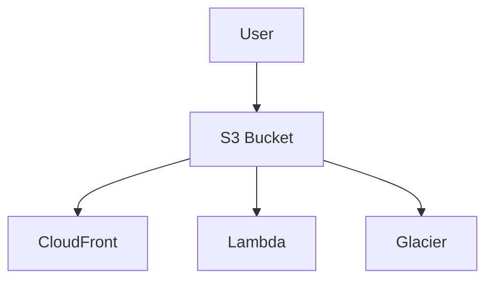

# S3 Use Cases

## 1. Static Website Hosting
- Host static HTML, CSS, JS files.
- Use CloudFront for CDN.

## 2. Backup and Restore
- Store backups from EC2, RDS, on-premises.
- Use lifecycle policies to move to Glacier.

## 3. Data Lake
- Store raw and processed data for analytics.
- Integrate with Athena, Redshift, EMR.

## 4. Big Data Analytics
- Store input/output for EMR, Glue, Athena.

## 5. Disaster Recovery
- Cross-region replication for DR.

## Architecture Pattern Example

