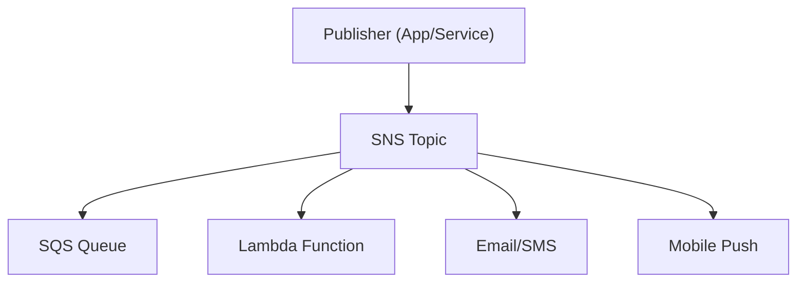

# Amazon SNS (Simple Notification Service) - Detailed Overview

## What is SNS?
Amazon SNS is a fully managed pub/sub messaging service that enables you to decouple microservices, distributed systems, and serverless applications. It allows you to send messages to multiple subscribers (endpoints) simultaneously, using a variety of protocols.

## Why Use SNS?
- **Pub/Sub messaging:** One-to-many message delivery (fan-out)
- **Multi-protocol:** Deliver messages via HTTP/S, email, SMS, Lambda, SQS, mobile push, and more
- **Scalable:** Handles millions of messages per second
- **Integrated with AWS:** Works with Lambda, SQS, CloudWatch, EventBridge, and more
- **Cost-effective:** Pay only for what you use

## Core Concepts
### 1. **Topics**
- Logical access point for publishing messages
- Publishers send messages to topics; subscribers receive messages from topics

### 2. **Subscriptions**
- Endpoints that receive messages from a topic
- Protocols: HTTP/S, email, SMS, SQS, Lambda, application (mobile push)
- Can have multiple subscriptions per topic

### 3. **Message Delivery**
- **Fan-out:** One message to a topic can be delivered to many endpoints (SQS, Lambda, etc.)
- **Retries:** SNS automatically retries failed deliveries (configurable policies)
- **Message filtering:** Subscribers can filter messages by attributes

### 4. **Security**
- **IAM policies:** Control who can publish/subscribe
- **Topic policies:** Fine-grained access control
- **Encryption:** At rest (KMS) and in transit (TLS)
- **VPC endpoints:** Private connectivity to SNS

### 5. **Advanced Features**
- **Message filtering:** Deliver only relevant messages to each subscriber
- **Raw message delivery:** Send unmodified messages to SQS/Lambda
- **Delivery status logging:** Monitor delivery success/failure
- **Mobile push notifications:** Integrate with APNS, FCM, ADM, Baidu

## Step-by-Step: Creating and Using a Topic (Console)
1. Go to the SNS Dashboard in AWS Console
2. Click "Create topic" (Standard or FIFO)
3. Configure topic settings (name, display name, encryption, access policy)
4. Create subscriptions (choose protocol and endpoint)
5. Publish messages via console, CLI, or SDK
6. Monitor delivery status and metrics in CloudWatch

## Real-World Example: Order Notification System
- Order service publishes events to an SNS topic
- SQS queue (for order processing), Lambda (for analytics), and email (for notifications) all subscribe to the topic
- Message filtering ensures only relevant endpoints receive each message

## Advanced Features & Best Practices
- **Use message filtering to reduce unnecessary processing**
- **Enable delivery status logging for troubleshooting**
- **Encrypt sensitive messages with SSE (KMS)**
- **Use VPC endpoints for private connectivity**
- **Monitor with CloudWatch for delivery metrics and errors**

## Common Pitfalls & Misconceptions
- **No message persistence:** SNS does not store messages if delivery fails (except for SQS/Lambda)
- **IAM and topic policies must allow both publisher and subscriber actions**
- **SMS/email delivery can be rate-limited or blocked by providers**
- **FIFO topics require FIFO subscriptions (SQS FIFO, Lambda FIFO)**

## How SNS Fits in AWS Architectures
- SNS is the default pub/sub service for event-driven, decoupled architectures
- Used for fan-out, notifications, mobile push, and integrating AWS services
- Integrates with Lambda, SQS, CloudWatch, EventBridge, and more

## Visual Diagram

## Further Reading
- [SNS Documentation](https://docs.aws.amazon.com/sns/latest/dg/welcome.html)
- [Best Practices](https://docs.aws.amazon.com/sns/latest/dg/sns-best-practices.html)
