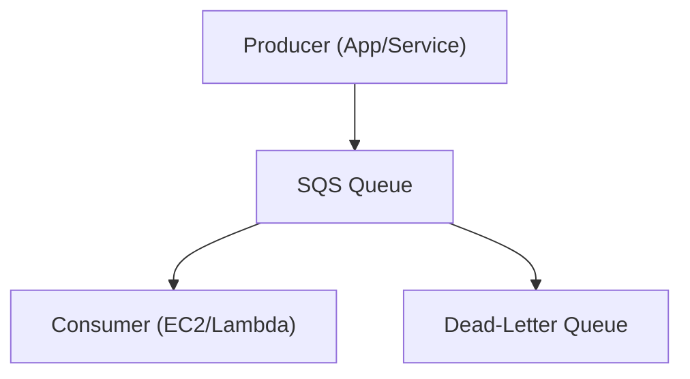

# Amazon SQS (Simple Queue Service) - Detailed Overview

## What is SQS?
Amazon SQS is a fully managed message queuing service that enables decoupling and scaling of microservices, distributed systems, and serverless applications. It allows you to send, store, and receive messages between software components at any volume, without losing messages.

## Why Use SQS?
- **Decoupling:** Separate producers and consumers for scalable, fault-tolerant architectures
- **Reliability:** Guarantees at-least-once delivery and durability
- **Scalability:** Handles virtually unlimited throughput
- **Cost-effective:** Pay only for what you use
- **Integrated with AWS:** Works with Lambda, EC2, ECS, SNS, Step Functions, and more

## Core Concepts
### 1. **Queue Types**
- **Standard Queue:** Nearly unlimited throughput, at-least-once delivery, best-effort ordering
- **FIFO Queue:** Exactly-once processing, strict ordering, limited throughput (up to 3000 messages/sec with batching)
- **Dead-Letter Queue (DLQ):** Captures messages that can't be processed successfully

### 2. **Message Lifecycle**
- **SendMessage:** Producer sends a message to the queue
- **ReceiveMessage:** Consumer retrieves a message (message becomes invisible to others)
- **DeleteMessage:** Consumer deletes the message after processing
- **Visibility Timeout:** Time during which a message is invisible after being received (default 30s, max 12h)
- **Retention Period:** How long messages are kept in the queue (1 min to 14 days, default 4 days)

### 3. **Long Polling**
- Reduces empty responses and cost by waiting up to 20 seconds for messages to arrive
- Use `WaitTimeSeconds` parameter in ReceiveMessage

### 4. **Security**
- **IAM policies:** Control who can send/receive/delete messages
- **Server-side encryption (SSE):** Encrypt messages at rest with KMS
- **VPC endpoints:** Private connectivity to SQS

### 5. **Advanced Features**
- **Message timers:** Delay delivery of individual messages
- **Batch operations:** Send/receive/delete up to 10 messages at once
- **Dead-letter queues:** Handle poison messages and retries
- **Lambda triggers:** Process messages serverlessly

## Step-by-Step: Creating and Using a Queue (Console)
1. Go to the SQS Dashboard in AWS Console
2. Click "Create queue" and choose Standard or FIFO
3. Configure queue settings (name, retention, visibility timeout, encryption, DLQ)
4. Send messages via console, CLI, or SDK
5. Receive and process messages with consumers (EC2, Lambda, etc.)
6. Monitor queue metrics in CloudWatch

## Real-World Example: Order Processing System
- Web app sends order messages to SQS
- Worker EC2 instances or Lambda functions process orders asynchronously
- Failed messages are sent to a DLQ for later analysis

## Advanced Features & Best Practices
- **Use DLQs for error handling and debugging**
- **Tune visibility timeout to match processing time**
- **Use long polling to reduce costs and latency**
- **Encrypt sensitive messages with SSE**
- **Monitor with CloudWatch for age, depth, and error metrics**

## Common Pitfalls & Misconceptions
- **Messages are not deleted automatically:** Must call DeleteMessage after processing
- **Visibility timeout too short:** Can lead to duplicate processing
- **DLQ not configured:** Lost opportunity for error analysis
- **FIFO queues have throughput limits**

## How SQS Fits in AWS Architectures
- SQS is the default message queue for decoupling microservices, serverless, and distributed systems
- Integrates with Lambda, SNS, EC2, ECS, Step Functions, and more

## Visual Diagram

## Further Reading
- [SQS Documentation](https://docs.aws.amazon.com/AWSSimpleQueueService/latest/SQSDeveloperGuide/)
- [Best Practices](https://docs.aws.amazon.com/AWSSimpleQueueService/latest/SQSDeveloperGuide/sqs-best-practices.html)
