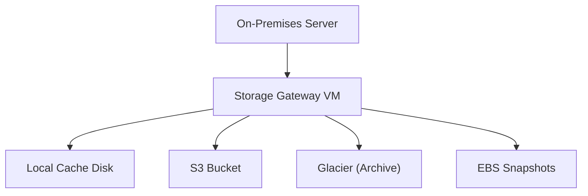

# AWS Storage Gateway - Detailed Overview

## What is Storage Gateway?
AWS Storage Gateway is a hybrid cloud storage service that connects on-premises environments with AWS cloud storage. It enables you to seamlessly integrate your on-premises applications with AWS storage services (S3, Glacier, EBS, Tape) using standard protocols.

## Why Use Storage Gateway?
- **Hybrid cloud:** Bridge on-premises and cloud storage
- **Seamless integration:** Use standard protocols (NFS, SMB, iSCSI, VTL)
- **Cost-effective:** Store data in AWS, keep frequently accessed data local
- **Backup and disaster recovery:** Offsite backups, archive, and restore

## Gateway Types
### 1. **File Gateway**
- Presents a file share (NFS/SMB) to on-premises clients
- Files are stored as objects in S3, with local cache for fast access
- Supports S3 Object Lock, lifecycle policies, and access control

### 2. **Volume Gateway**
- Presents iSCSI block storage to on-premises servers
- Data is asynchronously backed up to AWS as EBS snapshots
- Two modes:
  - **Cached:** Frequently accessed data is local, full dataset in AWS
  - **Stored:** Full dataset is local, with async backup to AWS

### 3. **Tape Gateway**
- Presents a virtual tape library (VTL) to backup applications
- Virtual tapes are stored in S3 and archived to Glacier
- Drop-in replacement for physical tape infrastructure

## Core Architecture
- **Gateway appliance:** Runs as a VM (VMware, Hyper-V, KVM) or as a hardware appliance
- **Local cache:** Frequently accessed data is cached on-premises for low latency
- **Cloud storage:** Data is stored in S3, EBS, or Glacier
- **Management:** Configure and monitor via AWS Console, CLI, or API

## Step-by-Step: Deploying a File Gateway (Console)
1. Download and deploy the Storage Gateway VM on-premises
2. Activate the gateway in the AWS Console
3. Configure local disks for cache and upload buffer
4. Create a file share (NFS/SMB) and map to an S3 bucket
5. Mount the file share on your on-premises servers
6. Monitor usage and performance in the AWS Console

## Real-World Examples
- **File Gateway:** Cloud backup for file servers, data lakes, analytics
- **Volume Gateway:** Backup and disaster recovery for on-premises apps
- **Tape Gateway:** Replace physical tape libraries for backup/archive

## Advanced Features & Best Practices
- **Use local cache disks sized for your workload**
- **Enable S3 Object Lock for compliance**
- **Use lifecycle policies to move data to Glacier for cost savings**
- **Monitor cache hit ratio and throughput with CloudWatch**
- **Secure with IAM, encryption at rest/in transit, and VPC endpoints**

## Common Pitfalls & Misconceptions
- **Cache size impacts performance:** Too small = frequent cloud access
- **File Gateway is not a full NAS replacement:** No POSIX locking, limited metadata
- **Tape Gateway is for backup/archive, not active data**
- **Network bandwidth affects upload speed**

## How Storage Gateway Fits in AWS Architectures
- Enables hybrid cloud storage, backup, and DR
- Integrates with S3, Glacier, EBS, backup software, and on-premises apps

## Visual Diagram

## Further Reading
- [Storage Gateway Documentation](https://docs.aws.amazon.com/storagegateway/)
- [Best Practices](https://docs.aws.amazon.com/storagegateway/latest/userguide/best-practices.html)
- [Deployment Guides](https://docs.aws.amazon.com/storagegateway/latest/userguide/deploying-gateway.html)
