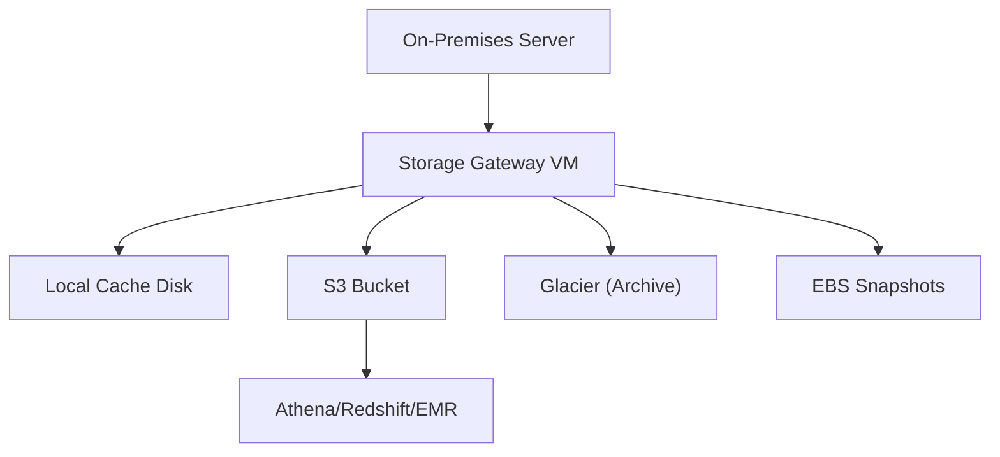

# Storage Gateway Use Cases

## 1. Hybrid Cloud File Storage
- Use File Gateway to provide on-premises applications with low-latency access to cloud-backed file shares (NFS/SMB).
- Example: A video production company stores large media files locally for editing, with automatic backup to S3 for archiving and sharing.

## 2. Cloud Backup and Disaster Recovery
- Use Volume Gateway (cached or stored mode) to back up on-premises block storage to AWS as EBS snapshots.
- Example: A financial services firm backs up its on-premises databases to AWS for offsite disaster recovery and rapid restore.

## 3. Tape Replacement and Archiving
- Use Tape Gateway to replace physical tape libraries with virtual tapes stored in S3 and archived to Glacier.
- Example: A healthcare provider archives medical records to virtual tapes for compliance and long-term retention.

## 4. Data Lake Ingestion and Analytics
- Use File Gateway to ingest on-premises data into S3 for analytics with Athena, Redshift, or EMR.
- Example: A manufacturing company collects IoT sensor data on-premises and uses File Gateway to move it to S3 for big data analytics.

## 5. Compliance and Regulatory Storage
- Use S3 Object Lock with File Gateway for WORM (Write Once, Read Many) compliance.
- Example: A legal firm stores case files with retention policies enforced by S3 Object Lock for regulatory compliance.

## 6. Multi-Site Collaboration
- Multiple offices use File Gateway to share and synchronize files via a central S3 bucket, enabling global collaboration.

## Architecture Pattern Example

