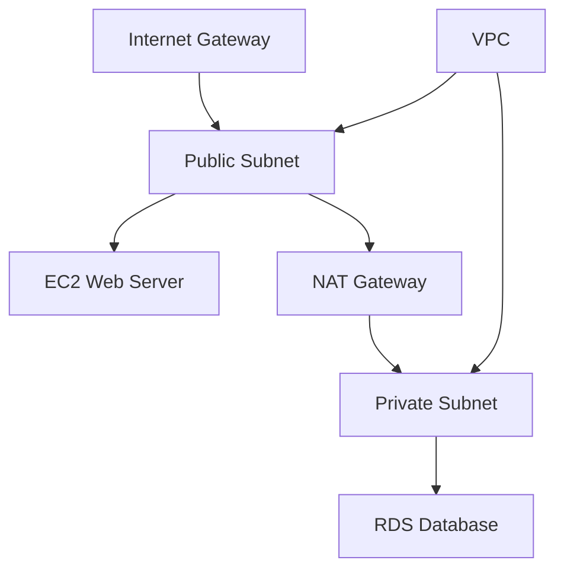

# Amazon VPC (Virtual Private Cloud) - Detailed Overview

## What is a VPC?
A VPC is like your own private data center in the AWS cloud. It lets you define a virtual network where you can launch AWS resources (like EC2, RDS, Lambda) in a secure, isolated environment. You control the IP address range, subnets, routing, and security.

## Why Use a VPC?
- **Isolation:** Your resources are separated from others in AWS.
- **Security:** Control inbound/outbound traffic with firewalls.
- **Customization:** Choose your own IP ranges, subnets, and routing.
- **Hybrid:** Connect your VPC to your on-premises network.

## Key Concepts
### 1. **CIDR Block**
- The IP address range for your VPC (e.g., 10.0.0.0/16).
- You can split this into smaller subnets.

### 2. **Subnets**
- Subdivisions of your VPC, each in a single Availability Zone (AZ).
- **Public Subnet:** Has a route to the internet (via IGW).
- **Private Subnet:** No direct route to the internet.

### 3. **Route Tables**
- Control how traffic moves within your VPC and to the internet.
- Each subnet is associated with a route table.

### 4. **Internet Gateway (IGW)**
- Allows resources in public subnets to access the internet.
- Attach one IGW per VPC.

### 5. **NAT Gateway/Instance**
- Lets resources in private subnets access the internet (for updates, etc.) without being exposed to inbound traffic.

### 6. **Security Groups**
- Virtual firewalls at the instance level.
- Control inbound and outbound traffic (stateful).

### 7. **Network ACLs (NACLs)**
- Subnet-level firewalls.
- Control inbound and outbound traffic (stateless).

### 8. **VPC Peering & Endpoints**
- **Peering:** Connect two VPCs privately (even across accounts/regions).
- **Endpoints:** Private access to AWS services (e.g., S3, DynamoDB) without using the internet.

### 9. **Flow Logs**
- Capture and analyze network traffic for security and troubleshooting.

## Step-by-Step: Creating a VPC (Console)
1. Go to the VPC Dashboard in AWS Console.
2. Click "Create VPC".
3. Enter a name and CIDR block (e.g., 10.0.0.0/16).
4. Add subnets in different AZs (for high availability).
5. Attach an Internet Gateway.
6. Create route tables and associate with subnets.
7. Set up security groups and NACLs.

## Real-World Example: 3-Tier Web App
- **Public Subnet:** Load balancer, bastion host.
- **Private Subnet:** App servers (EC2, Lambda).
- **Private Subnet (DB):** Databases (RDS, Aurora).
- **NAT Gateway:** Allows app servers to download updates securely.

## Common Pitfalls & Misconceptions
- **Overlapping CIDR blocks:** Prevent VPC peering.
- **No IGW:** Public subnet resources can't access the internet.
- **NACLs are stateless:** Must allow return traffic explicitly.
- **Security Groups are stateful:** Return traffic is automatically allowed.

## How VPC Fits in AWS Architectures
- Every AWS account gets a default VPC, but custom VPCs are best for production.
- VPC is the foundation for secure, scalable AWS solutions.
- Used with EC2, RDS, Lambda, and more.

## Visual Diagram

## Further Reading
- [AWS VPC Documentation](https://docs.aws.amazon.com/vpc/)
- [VPC Best Practices](https://docs.aws.amazon.com/vpc/latest/userguide/VPC_Scenario2.html)
