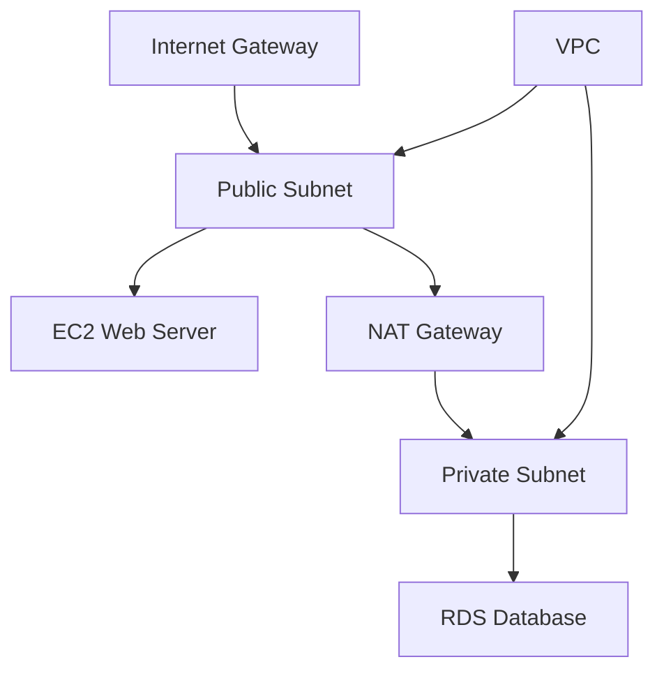

# VPC Use Cases

## 1. Multi-Tier Web Application
- Public subnet for web servers, private subnet for databases.
- Use NAT Gateway for outbound internet from private subnet.

## 2. Hybrid Cloud
- Connect on-premises data center with VPN or Direct Connect.
- Use private subnets for sensitive workloads.

## 3. Microservices
- Isolate services in different subnets or VPCs.
- Use VPC Peering or Transit Gateway for communication.

## 4. Secure Data Storage
- Use VPC endpoints for private S3/DynamoDB access.

## Architecture Pattern Example

